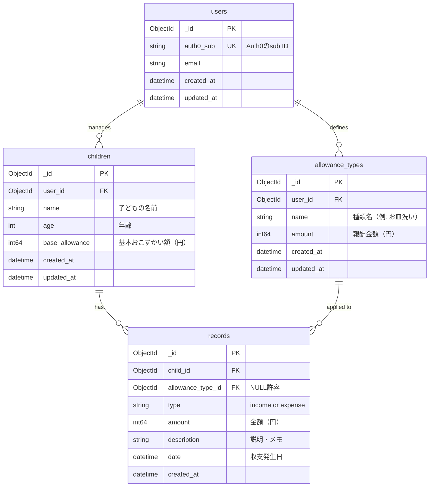

# 子どものおこずかい管理アプリ

## プロジェクト概要

子どものおこずかいの収支を管理するPWAアプリ。
子どもがお手伝いした回数に応じて、今月のおこずかいを決定します。
親が子どもに渡したおこずかい、これから渡すおこずかいを管理できる。

## 技術スタック

| レイヤー | 技術 |
|----------|------|
| フロントエンド | Angular (最新安定版) + GitHub Pages |
| PWA | Angular Service Worker (`@angular/pwa`) |
| 認証 | Auth0 (`@auth0/auth0-angular`) |
| バックエンド | AWS Lambda + API Gateway (サーバレス) |
| ランタイム | Go (Lambda) |
| データベース | MongoDB Atlas (無料枠 M0, ap-northeast-1) + mongo-driver (Go) |
| IaC | AWS SAM |
| 言語 | 日本語のみ（多言語対応なし）|

## アーキテクチャ

```
money-management/
├── frontend/                   # Angularアプリ (PWA)
│   ├── src/
│   │   ├── app/
│   │   │   ├── auth/           # Auth0認証関連
│   │   │   ├── core/           # シングルトンサービス、ガード
│   │   │   ├── shared/         # 共有コンポーネント、パイプ
│   │   │   └── features/       # 機能モジュール
│   │   │       ├── dashboard/      # ホーム画面
│   │   │       ├── children/       # 子ども管理（複数人対応）
│   │   │       ├── allowance-types/ # おこづかい種類管理
│   │   │       └── chore-register/ # お手伝い登録（子ども向け）
│   │   └── environments/
│   └── ngsw-config.json        # Service Worker設定
└── backend/                    # AWS Lambda関数群
    ├── src/
    │   ├── functions/          # Lambda関数（エンドポイントごと）
    │   │   ├── children/       # 子ども管理API
    │   │   └── records/        # 収支記録API
    │   ├── models/             # MongoDBモデル（Goの構造体）
    │   ├── middleware/         # Auth0 JWT検証
    │   └── lib/                # DB接続など共通処理
    ├── template.yaml           # AWS SAM定義
    └── .env
```

### インフラ構成（AWS サーバレス）

```
[Angular PWA]
    │  HTTPS + Access Token
    ▼
[AWS API Gateway]
    │
    ├──▶ [Lambda Authorizer] ──▶ [Auth0 JWKS] で署名検証
    │         │ 認証OK → IAM Policy 発行
    │         │ 認証NG → 401 Unauthorized
    │
    ├──▶ [Lambda: children]
    │         │
    └──▶ [Lambda: records]
              │
              ▼
       [MongoDB Atlas]
         (無料枠 M0)
```

**無料枠の目安**
- AWS Lambda: 月100万リクエスト、400,000 GB-秒まで無料
- API Gateway: 月100万呼び出しまで無料（12ヶ月）
- MongoDB Atlas M0: 512MB ストレージ永久無料
- Auth0: 月7,500アクティブユーザーまで無料

## 認証フロー

### ユーザー登録
- ユーザー登録はアプリ画面からは行わない
- 事前に **Auth0コンソール** で親ユーザーを手動登録しておく
- 登録済みユーザーのみログイン・利用可能

### ログイン〜API呼び出し
1. アプリ起動時に `AuthGuard` が認証状態をチェック
2. 未認証の場合は Auth0 のログイン画面にリダイレクト
3. ログイン成功後、Auth0 がアクセストークン（JWT）を発行
4. フロントエンドはすべてのAPIリクエストに `Authorization: Bearer <token>` を付与
5. API Gatewayが **Lambda Authorizer** を呼び出してトークンを検証
   - Auth0の公開鍵（JWKS）でトークンの署名を検証
   - 検証OK → IAM Policyを発行してLambda関数の実行を許可
   - 検証NG → `401 Unauthorized` を返す（Lambda関数は実行されない）
6. 認証済みLambda関数はトークンの `sub` クレームでユーザーを識別しDBアクセス

### アクセス制御原則
- **公開エンドポイントは存在しない**（すべてのAPIにLambda Authorizerが必須）
- AngularのAuthGuardはUI上の保護（UX目的）、APIレベルはLambda Authorizerで担保
- ユーザーは自分の `auth0_sub` に紐づくデータのみ操作可能

## 主要機能

- [x] 子ども情報の管理（名前、年齢、基本おこずかい額）
- [x] おこずかいの種類管理（種類名・報酬金額）
- [x] お手伝い登録（子ども向けのシンプルUI。種類ごとに1日1回まで）
- [x] 収入・支出の記録（親が手動登録）
- [x] 残高の確認（子ども詳細画面）
- [x] 収支履歴の表示（月フィルタあり）
- [x] PWA対応（ホーム画面追加・Service Worker）

## 開発ルール

### コーディング規約
- Angular の公式スタイルガイドに従う
- コンポーネントは Standalone Components で作成する
- 状態管理はシンプルに RxJS + サービスで行う（NgRx は使わない）
- CSS は Angular Material を使用する

### API設計
- RESTful に設計する
- エンドポイントは `/api/v1/` プレフィックスを付ける
- **すべてのエンドポイントはLambda Authorizerで保護する（公開エンドポイントなし）**
- Lambda Authorizerは別Lambdaとして独立させ、API Gatewayに紐づける
- Lambda関数はエンドポイント（リソース）単位で分割する
- DB接続はLambdaのグローバルスコープでコネクションを再利用する（コールドスタート対策）

### 環境変数
- フロントエンド: `environment.ts`（gitignore済み・初回は `environment.ts.example` からコピー）/ `environment.prod.ts`（CI/CDでプレースホルダーを置換）で管理
- バックエンド: `.env` ファイルで管理（`.env` は `.gitignore` に追加）
- Auth0のドメイン、クライアントIDなどの機密情報はコードに直書きしない

### テスト
- グローバルの `CLAUDE.md` に記載のテスト原則を遵守する
- ユニットテスト: `go test` + `testcontainers`（バックエンド統合テスト）/ Karma + Jasmine（フロントエンド）
- E2Eテスト: Playwright（必要に応じて）
- Lambda関数のローカルテストは `sam local` を使用する

#### カバレッジ目標

| 対象 | 目標 | 理由 |
|------|------|------|
| ビジネスロジック（残高計算・バリデーション） | **90%以上** | 金額の誤りは致命的 |
| バックエンド全体（Go） | **70%以上** | CI で `go test -cover` により計測・強制 |
| フロントエンド Service | **80%以上** | APIロジック・状態管理の中核 |
| フロントエンド Component | **60%以上** | 入出力・イベントに集中してテスト |
| AuthGuard / JWT検証ミドルウェア | **90%以上** | 認証バイパスは最大のリスク |

#### テストしない範囲（明示的に除外）

- Angular Material 等のサードパーティコンポーネント自体の動作
- `environment.ts` の設定値（定数であり検証不要）
- Goの単純なgetter/setter（ロジックを持たないもの）
- Auth0 SDKの内部動作
- Lambdaのエントリーポイント `main` パッケージ（統合テストで担保）
- 自動生成コード

#### バックエンド（Go）テスト方針

- **テーブル駆動テスト**（Table-Driven Tests）を基本とする
- `memongo` でインメモリMongoDBを起動し、実際のクエリを検証する
- 各テストは独立して実行できるようにする（テスト間の順序依存を禁止）
- テストファイルは対象ファイルと同ディレクトリに `_test.go` として配置する

```go
// テーブル駆動テストの例（残高計算）
func TestCalcBalance(t *testing.T) {
    tests := []struct {
        name    string
        records []Record
        want    int64
    }{
        {"収入のみ", []Record{{Type: "income", Amount: 1000}}, 1000},
        {"収支あり", []Record{{Type: "income", Amount: 1000}, {Type: "expense", Amount: 300}}, 700},
        {"空レコード", []Record{}, 0},
    }
    for _, tt := range tests {
        t.Run(tt.name, func(t *testing.T) {
            got := CalcBalance(tt.records)
            if got != tt.want {
                t.Errorf("got %d, want %d", got, tt.want)
            }
        })
    }
}
```

#### フロントエンド（Angular）テスト方針

- HTTP通信は `HttpClientTestingModule` でモックする
- Auth0は `AuthService` をスタブ化し、SDK内部に依存しない
- コンポーネントテストはテンプレートではなく**入出力とイベント**に集中する
- 非同期処理は `fakeAsync` / `tick` を使用する

## MongoDB スキーマ設計



### コレクション詳細

| コレクション | 説明 | インデックス |
|-------------|------|-------------|
| `users` | 親ユーザー。Auth0のsub IDで一意に識別 | `auth0_sub` (unique) |
| `children` | 子ども。1ユーザーに複数紐づく | `user_id` |
| `allowance_types` | おこづかいの種類。ユーザーが自由に定義 | `user_id` |
| `records` | 収支記録。収入(income)・支出(expense) | `child_id`, `date` |

Goでは各コレクションに対応する構造体を定義し、`bson` タグでシリアライズ/デシリアライズを行う。

## セットアップ手順

### ローカル開発の初回セットアップ（フロントエンド）
`environment.ts` は `.gitignore` により Git 管理外のため、初回クローン時に手動作成が必要。
```bash
cd frontend
cp src/environments/environment.ts.example src/environments/environment.ts
# environment.ts を開き、Auth0 の domain・clientId・audience を設定する
```

```bash
# フロントエンド
cd frontend
npm install
ng serve

# バックエンド（ローカル）
cd backend
go build ./...                     # Goビルド
sam build && sam local start-api   # AWS SAMでローカル起動
```

### バックエンドの手動デプロイ

`samconfig.toml` をテンプレートから作成し、実際の値を設定してからデプロイする。

```bash
cd backend

# テンプレートをコピーして実際の値を設定
cp samconfig.toml.example samconfig.toml
# samconfig.toml の各プレースホルダー（YOUR_AUTH0_DOMAIN 等）を実際の値に書き換える

# ビルド＆デプロイ
sam build
sam deploy
# → samconfig.toml の [default.deploy.parameters] が使用される
# → confirm_changeset = true のため、変更内容を確認後に適用する
```

> **注意:** `samconfig.toml` は機密情報（MongoDB URI 等）を含むため `.gitignore` 済み。
> コミットしないこと。CI/CD では GitHub Secrets から値を注入する。

### PWA アイコンの再生成

アイコンデザインを変更したい場合は、`sharp`（devDependency として追加済み）を使って再生成する。

```bash
cd frontend

# generate-icons.mjs を作成してSVGを編集後、実行：
node generate-icons.mjs
# → public/icons/ 以下の全サイズ（72〜512px）が上書きされる
```

- アイコンのデザイン（SVG）は `generate-icons.mjs` 内に直書きされている
- スクリプト実行後はファイルを削除してコミットしてよい（アイコン自体をコミットする）
- カラーはアプリのプライマリカラー `#1565c0`（ブルー）と `#f9a825`（アンバー/¥コイン）を使用

## 画面一覧

詳細は [`docs/screen-design.md`](docs/screen-design.md) を参照。

画面は「子ども向け」と「親向け管理」の2グループに分かれる。
ログイン後のデフォルト画面は子ども向けのお手伝い登録画面（`/`）。
親向け管理画面はお手伝い登録画面の管理ボタンからアクセスする。
画面数は全10画面（ログイン含む）。

## API一覧

詳細は [`docs/api-design.md`](docs/api-design.md) を参照。

すべてのエンドポイントは Auth0 JWT による認証が必要（公開エンドポイントなし）。
ベースURL: `/api/v1/`、3リソース（`children` / `allowance-types` / `records`）、計13エンドポイント。