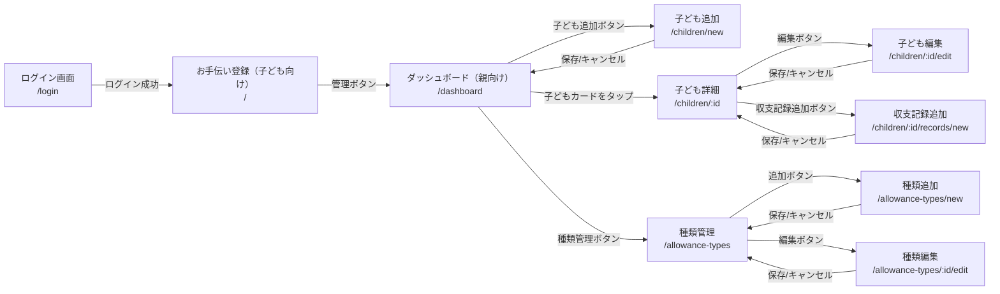

# 画面設計書

## 画面構成の方針

画面は用途によって2グループに分かれる。

| グループ | 対象 | 特徴 |
|----------|------|------|
| 子ども向け | 子ども | シンプル・大きなUI・操作ステップを最小化 |
| 親向け管理 | 親 | 一覧・編集・管理機能 |

ログイン後のデフォルト画面は **子ども向けお手伝い登録画面（`/`）**。
親向け管理画面は、お手伝い登録画面の管理ボタンからアクセスする。

---

## 画面遷移図



---

## 画面一覧

### 子ども向け画面

| # | 画面名 | パス | 認証 |
|---|--------|------|------|
| 1 | ログイン | `/login` | 不要 |
| 2 | お手伝い登録 | `/` | 必要 |

### 親向け管理画面

| # | 画面名 | パス | 認証 |
|---|--------|------|------|
| 3 | ダッシュボード | `/dashboard` | 必要 |
| 4 | 子ども追加 | `/children/new` | 必要 |
| 5 | 子ども詳細 | `/children/:id` | 必要 |
| 6 | 子ども編集 | `/children/:id/edit` | 必要 |
| 7 | 収支記録追加 | `/children/:id/records/new` | 必要 |
| 8 | 種類管理 | `/allowance-types` | 必要 |
| 9 | 種類追加 | `/allowance-types/new` | 必要 |
| 10 | 種類編集 | `/allowance-types/:id/edit` | 必要 |

---

## 各画面詳細

---

### 1. ログイン画面 (`/login`)

**目的:** Auth0によるユーザー認証

**表示内容:**
- アプリ名・ロゴ
- ログインボタン

**動作:**
- ログインボタン押下 → Auth0のユニバーサルログイン画面へリダイレクト
- ログイン成功 → `/` へリダイレクト
- すでに認証済みの場合 → `/` へ自動リダイレクト

**備考:**
- ユーザー登録はAuth0コンソールで事前に実施済みのため、サインアップリンクは非表示にする
- `AuthGuard` が未認証ユーザーをこの画面にリダイレクト

---

### 2. お手伝い登録画面 (`/`) ※子ども向けデフォルト画面

**目的:** 子どもがお手伝いの内容をタップ操作だけで登録できるシンプルな画面

**UI方針:**
- 大きなボタン・カードで操作しやすくする
- テキスト入力を排除し、選択操作のみで完結
- 2ステップで登録完了

**ステップ1: 子ども選択**

```
┌─────────────────────────────────┐
│                        [管理 ⚙] │
│                                  │
│      名前をえらぶ                 │
│                                  │
│  ┌──────────┐  ┌──────────┐    │
│  │          │  │          │    │
│  │  たろう  │  │  はなこ  │    │
│  │          │  │          │    │
│  └──────────┘  └──────────┘    │
│                                  │
└─────────────────────────────────┘
```

**ステップ2: お手伝い種類選択**

```
┌─────────────────────────────────┐
│  ←  たろう             [管理 ⚙]│
│                                  │
│    なにをしたの？                 │
│                                  │
│  ┌──────────┐  ┌──────────┐    │
│  │ お皿洗い │  │掃除機かけ│    │
│  │   ¥50   │  │   ¥80   │    │
│  └──────────┘  └──────────┘    │
│  ┌──────────┐  ┌──────────┐    │
│  │洗濯物    │  │テスト    │    │
│  │たたみ    │  │100点     │    │
│  │   ¥30   │  │  ¥500   │    │
│  └──────────┘  └──────────┘    │
│                                  │
└─────────────────────────────────┘
```

**完了表示（登録成功後）:**

```
┌─────────────────────────────────┐
│                                  │
│         🎉 登録できたよ！         │
│                                  │
│      たろう の お皿洗い           │
│            ¥50                   │
│                                  │
│       [ もう1つ登録する ]         │
│                                  │
└─────────────────────────────────┘
```

**操作:**
- ステップ1で子ども名をタップ → ステップ2へ
- ステップ2でお手伝い種類をタップ → 確認なしで即座に登録 → 完了表示
- 完了表示の「もう1つ登録する」→ ステップ1へ戻る
- `[管理 ⚙]` ボタン → `/dashboard`
- ステップ2の `←` → ステップ1へ戻る

**API呼び出し:**
- `GET /api/v1/children`（ステップ1の子ども一覧）
- `GET /api/v1/allowance-types`（ステップ2の種類一覧）
- `POST /api/v1/children/:id/records`（登録）

**登録データ:**
- `type`: `"income"` 固定
- `amount`: 選択した種類の `amount`
- `description`: 選択した種類の `name`
- `date`: 今日の日付（自動）
- `allowance_type_id`: 選択した種類の `id`

---

### 3. ダッシュボード (`/dashboard`) ※親向け

**目的:** 子ども一覧と各残高の確認

**表示内容:**

```
┌─────────────────────────────────┐
│  ← おこづかい管理      [種類管理]│
├─────────────────────────────────┤
│ ┌───────────┐ ┌───────────┐    │
│ │  たろう   │ │  はなこ   │    │
│ │  8歳      │ │  6歳      │    │
│ │  残高     │ │  残高     │    │
│ │ ¥1,200   │ │  ¥800    │    │
│ └───────────┘ └───────────┘    │
│                                  │
│               [+ 子どもを追加]   │
└─────────────────────────────────┘
```

**操作:**
- `←` → `/`（お手伝い登録画面）
- `[種類管理]` → `/allowance-types`
- 子どもカードをタップ → `/children/:id`
- `[+ 子どもを追加]` → `/children/new`

**API呼び出し:**
- `GET /api/v1/children`

---

### 4. 子ども追加 (`/children/new`)

**目的:** 新しい子ども情報の登録

**フォーム項目:**

| 項目 | 入力形式 | バリデーション |
|------|----------|---------------|
| 名前 | テキスト | 必須、最大20文字 |
| 年齢 | 数値 | 必須、1〜18 |
| 基本おこずかい額（円） | 数値 | 必須、0以上 |

**操作:**
- `[保存]` → `POST /api/v1/children` → `/dashboard`
- `[キャンセル]` → `/dashboard`

---

### 5. 子ども詳細 (`/children/:id`)

**目的:** 特定の子どもの残高確認・収支履歴の閲覧・おこづかい支払い

**表示内容:**

```
┌─────────────────────────────────┐
│ ← たろう（8歳）          [編集] │
├─────────────────────────────────┤
│  残高（全期間）                  │
│  ¥1,200                         │
├─────────────────────────────────┤
│  [2026年3月 ▼]                  │
├─────────────────────────────────┤
│ 2026/03/27  お皿洗い   +¥50 🗑 │
│ 2026/03/25  おかし    -¥200 🗑 │
│ 2026/03/20  くもん     +¥50 🗑 │
├─────────────────────────────────┤
│  [おこづかいを渡す]  [+収支記録] │
└─────────────────────────────────┘
```

**表示項目:**
- 子どもの名前・年齢（ヘッダー）
- 残高（全期間合計）
- 月フィルタセレクタ（デフォルト: 当月）
- 収支履歴リスト（`created_at` 降順）
- 日付表示: `yyyy/MM/dd` 形式（JST）
- 収入: `+¥xxx` 緑、支出: `-¥xxx` 赤
- 各行に削除ボタン（🗑）

**おこづかいを渡すモード:**

```
┌─────────────────────────────────┐
│ ← たろう（8歳）          [編集] │
├─────────────────────────────────┤
│  残高（全期間）¥30               │
├─────────────────────────────────┤
│ □ 2026/03/30  くもん    +¥20   │  ← 未払い（チェック可）
│ □ 2026/03/29  くもん    +¥20   │  ← 未払い（チェック可）
│   2026/03/29  支払い   -¥40    │  ← 支払い記録（チェックなし）
│   2026/03/29  くもん    +¥20   │  ← 支払済み（チェックなし）
├─────────────────────────────────┤
│  [キャンセル]       [¥XX を渡す] │
└─────────────────────────────────┘
```

- `[おこづかいを渡す]` ボタン押下で支払いモードへ
- 未払いのincome記録にのみチェックボックスを表示
  - 未払い判定: `child.balance`（全期間残高）分を新しい順に充当
- 選択合計が残高を超える場合、`[渡す]` ボタンを無効化
- 確認ダイアログ承認後、選択合計額の expense レコードを作成して残高を更新

**操作:**
- `←` → `/dashboard`
- `[編集]` → `/children/:id/edit`
- `[+収支記録]` → `/children/:id/records/new`
- 月フィルタ変更 → 該当月のデータ再取得
- 🗑 → 確認ダイアログ → `DELETE /api/v1/children/:id/records/:recordId`

**API呼び出し:**
- `GET /api/v1/children/:id`
- `GET /api/v1/children/:id/records?year=2026&month=3`
- `DELETE /api/v1/children/:id/records/:recordId`
- `POST /api/v1/children/:id/records`（おこづかい支払い時）

---

### 6. 子ども編集 (`/children/:id/edit`)

**目的:** 子ども情報の変更・削除

**フォーム項目:**

| 項目 | 入力形式 | バリデーション |
|------|----------|---------------|
| 名前 | テキスト | 必須、最大20文字 |
| 年齢 | 数値 | 必須、1〜18 |
| 基本おこずかい額（円） | 数値 | 必須、0以上 |

- 現在の値をフォームに初期表示する

**操作:**
- `[保存]` → `PUT /api/v1/children/:id` → `/children/:id`
- `[キャンセル]` → `/children/:id`
- `[削除]`（危険操作）→ 確認ダイアログ → `DELETE /api/v1/children/:id` → `/dashboard`

**API呼び出し:**
- `GET /api/v1/children/:id`（初期値取得）
- `PUT /api/v1/children/:id`
- `DELETE /api/v1/children/:id`

---

### 7. 収支記録追加 (`/children/:id/records/new`) ※親向け

**目的:** 親が手動で収入または支出を記録する（お手伝い以外の収支）

**フォーム項目:**

| 項目 | 入力形式 | バリデーション |
|------|----------|---------------|
| 種別 | トグル（収入 / 支出） | 必須 |
| おこづかいの種類 | セレクトボックス（任意） | 収入選択時のみ表示 |
| 金額（円） | 数値 | 必須、1以上 |
| 説明 | テキスト | 必須、最大50文字 |
| 日付 | 日付ピッカー | 必須、デフォルト: 今日 |

**種類選択時の動作:**
- 種類を選択すると金額・説明フィールドに自動入力
- 自動入力後も手動変更可能

**操作:**
- `[保存]` → `POST /api/v1/children/:id/records` → `/children/:id`
- `[キャンセル]` → `/children/:id`

**API呼び出し:**
- `GET /api/v1/allowance-types`
- `POST /api/v1/children/:id/records`

---

### 8. 種類管理 (`/allowance-types`)

**目的:** おこづかいの種類と報酬金額の一覧・管理

**表示内容:**

```
┌─────────────────────────────────┐
│ ← 種類管理                [+追加]│
├─────────────────────────────────┤
│  お皿洗い              ¥50 [編集]│
│  掃除機かけ            ¥80 [編集]│
│  洗濯物たたみ          ¥30 [編集]│
│  テスト100点          ¥500 [編集]│
└─────────────────────────────────┘
```

**操作:**
- `←` → `/dashboard`
- `[+追加]` → `/allowance-types/new`
- `[編集]` → `/allowance-types/:id/edit`

**API呼び出し:**
- `GET /api/v1/allowance-types`

---

### 9. 種類追加 (`/allowance-types/new`)

**目的:** おこづかいの種類と報酬金額の登録

**フォーム項目:**

| 項目 | 入力形式 | バリデーション |
|------|----------|---------------|
| 種類名 | テキスト | 必須、最大30文字 |
| 報酬金額（円） | 数値 | 必須、1以上 |

**操作:**
- `[保存]` → `POST /api/v1/allowance-types` → `/allowance-types`
- `[キャンセル]` → `/allowance-types`

---

### 10. 種類編集 (`/allowance-types/:id/edit`)

**目的:** おこづかいの種類と報酬金額の変更・削除

**フォーム項目:**

| 項目 | 入力形式 | バリデーション |
|------|----------|---------------|
| 種類名 | テキスト | 必須、最大30文字 |
| 報酬金額（円） | 数値 | 必須、1以上 |

- 現在の値をフォームに初期表示する

**操作:**
- `[保存]` → `PUT /api/v1/allowance-types/:id` → `/allowance-types`
- `[キャンセル]` → `/allowance-types`
- `[削除]`（危険操作）→ 確認ダイアログ → `DELETE /api/v1/allowance-types/:id` → `/allowance-types`

**API呼び出し:**
- `GET /api/v1/allowance-types/:id`（初期値取得）
- `PUT /api/v1/allowance-types/:id`
- `DELETE /api/v1/allowance-types/:id`

---

## 共通仕様

### 認証
- `/login` 以外のすべての画面は `AuthGuard` で保護
- 未認証アクセスは `/login` にリダイレクト

### エラー表示
- APIエラー時はSnackBar（Angular Material）でメッセージ表示
- バリデーションエラーはフォームフィールド直下に表示

### ローディング
- API呼び出し中はスピナー表示（Angular Material `MatProgressSpinner`）

### PWA対応
- オフライン時は最後に取得したキャッシュデータを表示
- ネットワーク復帰後に自動同期は行わない（手動リロード）
